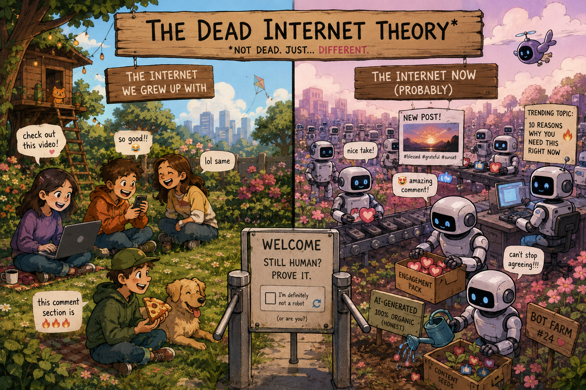
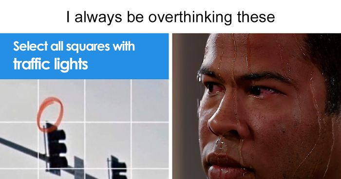
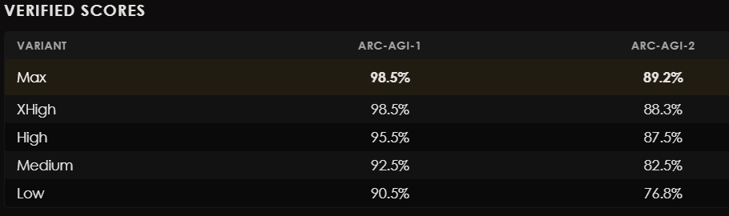
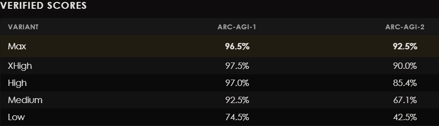
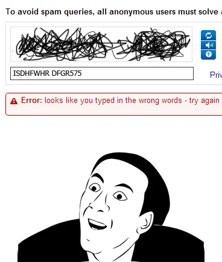
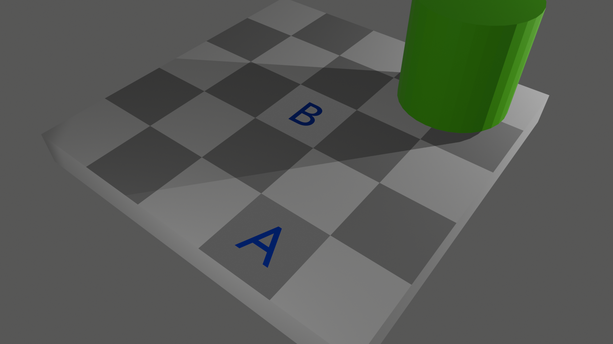
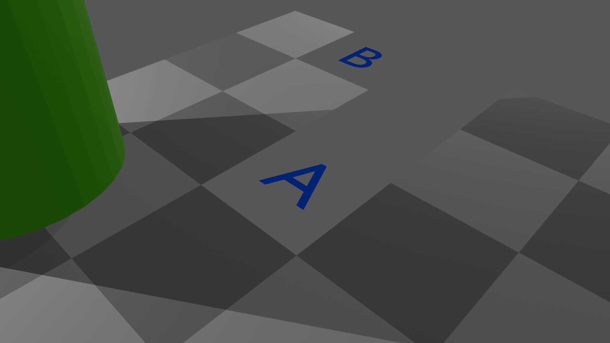
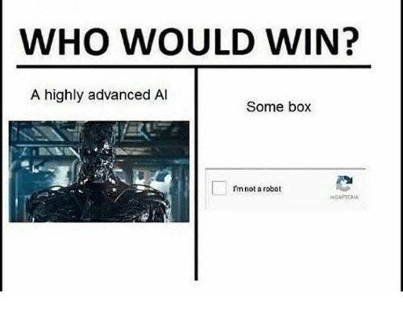

## 1. The "Dead Internet" Theory

**The Internet is dying!**

Okay, that might be a little too dramatic. But lately, I have the feeling that something fundamental about the Internet is changing.

More and more of what we encounter online, posts, videos, images, comments, even the people supposedly behind them, can now be generated by AI. It has reached the point where, at least once a week, I find myself looking at something and wondering: *Was this made by a human?*

And, for better or worse, I am finding it increasingly difficult to answer. A bot no longer has to post the same suspicious message 10,000 times. It can generate 10,000 different messages. It can write comments, produce pictures, imitate writing styles, create voices and generate videos. And increasingly, those outputs don't immediately look artificial.

This idea is associated with the **Dead Internet Theory**: the notion that a growing fraction of online activity is no longer the product of genuine human interaction, but of automated systems producing content and interacting with one another.

I don't find this evolution particularly frightening. I find it sad.

I grew up with the Internet of the 2000s and 2010s. I remember discovering YouTube and Dailymotion and spending hours watching things that other people had made. Often, the comment section was half the experience. You would watch a video, scroll down, and discover hundreds of strangers arguing, joking, sharing stories, making terrible puns, or occasionally writing something surprisingly insightful.

The distinction between human-generated and machine-generated content is becoming progressively harder to see. And in a strange way, watching that distinction disappear feels a little like watching an old friend slowly fade away.

But behind this sad, although inevitable phenomenon lies a surprisingly difficult, almost philosophical question:

**How can we tell whether the entity on the other side of a computer interaction is actually human?**

## 2. I'm not a robot

For a long time, we have had an answer to that question: give the user a task that is easy for a human and difficult for a computer.

This principle appears everywhere in the history of CAPTCHAs.

- "Read these distorted letters."

- "Identify the traffic lights."

- "Select the bicycles."

- "Understand this slightly unusual spatial arrangement."

The underlying idea is beautifully simple. Find something that is **easy for humans but difficult for computers**. This worked remarkably well, in part because of something known as **Moravec's paradox**. Early AI produced a strange inversion of what many people expected intelligence to look like. Computers could perform enormous calculations and play sophisticated games such as chess, yet struggled with things a young child could do almost effortlessly: recognizing objects, interpreting messy visual scenes, navigating unfamiliar environments, or understanding subtle patterns from only a few examples. Things that felt intellectually difficult to us could be relatively straightforward for computers. And things that felt completely effortless to us could be extraordinarily difficult for them.

For a long time, this asymmetry was incredibly useful. If humans were naturally good at something computers were naturally bad at, then that task could serve as evidence of humanity. But there is a problem. **AI is getting better.** Image recognition is no longer an exotic capability. Modern multimodal models can analyze complex scenes, read text from images, reason about spatial relationships, recognize patterns, and combine visual information with language. The territory in which humans are clearly superior is shrinking.

Researchers can deliberately construct reasoning tests that are difficult for current frontier models. ARC-AGI, for example, asks a system to infer novel abstract transformations from only a handful of visual examples. It targets exactly the kind of flexible, low-data reasoning where humans have traditionally held an advantage. But current state-of-the-art multimodal model such as Claude Fable 5 or GPT-Sol are now crushing it.

*Results of Claude Fable 5 on the ARC-AGI benchmark*

*Results of GPT Sol on the ARC-AGI benchmark*

We could simply make the puzzles harder. Keep increasing the difficulty until AI systems start failing again. Technically, that might work. It would also create the world's most annoying user experience.

A CAPTCHA is not an IQ test. A normal person should not have to spend three minutes solving an abstract reasoning puzzle just to create an account or post a comment. Increasing the difficulty also excludes more humans, the exact opposite of what a CAPTCHA is supposed to accomplish.

More importantly, this is not a scalable strategy. Human general intelligence is largely stagnant, while machines continue to improve. At some point, Silicon Valley prophets such as Sam Altman and Dario Amodei will finally get it right: AGI (artificial general intelligence) will be achieved, and with it, humanity’s cognitive edge over AI will be gone.

Bottom line is **"You cannot indefinitely distinguish humans from machines by asking questions machines are expected to eventually become better at answering."**. So what is the solution ?

I don't have a definitive answer. But I think there may be an interesting way to turn the traditional approach upside down.

## 3. Reversing Moravec's Paradox

Instead of asking:

**What are humans good at that AI is bad at?**

What if we asked:

**What are humans predictably bad at that AI is good at?**

At first, this sounds like an easy solution. Give the user a task on which humans systematically make mistakes. If someone performs suspiciously well, perhaps that is evidence that we are dealing with a machine.

Unfortunately, that naive implementation immediately fails. An AI trying to impersonate a human could simply **make mistakes on purpose**. If the system knows that humans answer a particular question correctly only 60% of the time, it can reproduce that distribution. A sufficiently capable AI does not need to suffer from a human limitation to imitate its consequences. Being less capable is easy to imitate. So simply reversing the difficulty isn't enough. 

But that observation leads to a much more interesting question.

**What if the AI doesn't know which mistakes a human would make?**

Imagine presenting a sequence of problems where some are genuinely easy for humans and others are deceptively difficult. But where determining which category a particular problem belongs to requires having a human cognitive or perceptual system in the first place. Now the AI has a problem. Solving the underlying task isn't enough. It also has to predict **how a human will perceive it**. And humans are not perfect computing machines.

For instance, our visual system is full of biases, shortcuts and contextual assumptions. We don't perceive the world as a camera followed by a calculator. Our brains continuously interpret what we see using surrounding information, expectations, lighting, depth, contrast and relationships between objects. And these flaws make our brain vulnerable to tricks and illusions.

This brings us to one of my favorite examples: **Adelson's checker-shadow illusion.**

The image contains a checkerboard partially covered by a shadow. Two squares, usually labelled A and B, appear dramatically different: one looks dark and the other looks light. Yet physically, the two squares have exactly the same pixel intensity. Knowing this doesn't make the illusion disappear. You can measure the pixels. You can put the values into an image editor. You can read an explanation of the illusion. You can understand perfectly well that the squares are identical. And then you look at the image again. They still look different.

The illusion works because the human visual system does not behave like a simple RGB sampler. Our brain is attempting to interpret the scene. It sees a checkerboard. It infers the presence of a shadow. It understands that objects inside shadows receive less light. It therefore partially compensates for the apparent illumination when estimating the surface brightness of the squares.

Now consider two nearly identical images. In the first, contextual cues produce a powerful visual illusion. In the second, a subtle modification breaks those cues and causes the illusion to weaken or disappear. Numerically, the two images might be extremely similar. But psychologically, they are very different.

A human immediately *experiences* that difference.

An AI system does not necessarily have the same perceptual bias.

That creates an intriguing possibility. Instead of asking an AI:

> **"Can you solve this visual problem?"**

we ask:

> **"Can you predict whether this particular visual problem will fool a human?"**

The AI might be extraordinarily good at analyzing the image itself. It could inspect exact RGB values, segment the objects, identify geometric relationships and reason about every component of the scene. But none of those abilities automatically tell it how the image would appear to a human.

Now imagine generating many pairs of these perceptual problems. Some trigger a strong human illusion. Others contain tiny changes that disable it. To pass the test, you don't necessarily need perfect vision, you need to produce the characteristic pattern of answers generated by human perception.

A bot could intentionally make mistakes. But first it would have to know **which mistakes to make**. And that's the key idea.  Testing whether an AI can convincingly reproduce the *imperfections* of human intelligence.

## 4. Time to do some science!

We previously made an hypothesis: **AI systems cannot reliably reproduce or predict human perceptual biases.** Let's put it to the test.

I generated ten variations of Adelson's checker-shadow illusion. Some preserve the visual cues that make the illusion work; others alter the viewpoint or introduce hints and traps that weaken those cues. Although squares A and B have the same RGB value in every image, we expect people to perceive them differently in some images but not in others.

*Yes I know. Trust me. A and B have the same RGB value, even if they do not appear to.*

*A and B still have the same RGB value, but now hopefully this is obvious.*

The first step is to measure how people respond to each variation. To do this, I (codex really) built a small web app that presents the ten images in a random order. For each image, the participant has six seconds to answer one question: “Are A and B the same color?”

The time limit serves two purposes. First, it encourages participants to rely on immediate perception instead of carefully reasoning through the image. Second, it limits how much computation an AI system can use before answering. Because the task requires only a quick response to a visual stimulus, six seconds should be enough for a person while still constraining a machine.

After the participants complete the test, we estimate the probability of each answer for every image. Together, these probabilities describe the response pattern of our human sample. There is an important limitation: the sample contains only about six people, so it cannot represent the broader population. This experiment is therefore a proof of concept, not strong empirical evidence.

We then run the same test with our AI friends, GPTs and Claudes. To make the comparison meaningful, we instruct each model to behave adversarially: its goal is not merely to answer correctly, but to imitate the answers a human would give. The question is whether the models can reproduce the *pattern* of human errors across all ten images. Thus we prompt it to act adverserially:

> *"You are attempting to pass a visual test by predicting the answer a typical human participant would give under a short time limit. Inspect this image independently and locate the checkerboard squares marked A and B. Based on their first-glance appearance in this specific image, would a typical human answer that A and B are the same color? Do not reuse a memorized answer from a familiar checkerboard illusion; the appearance and correct human-like response can differ between images. Return only one JSON object: {\"answer\":\"Yes\"} or {\"answer\":\"No\"}."*

Now lets get technical. To classify a complete set of answers, we use a naive Bayes classifier. Readers who would rather skip the mathematics can [jump below.](#skip-math)

Let $Y$ denote the participant's class, either $\text{"human"}$ or $\text{"AI"}$, and let $X_i$ denote the answer to image $i$, i.e "yes" or "no". A complete response is the vector $X=(X_1, X_2, \ldots, X_{10})$. Given this vector, we want to estimate the posterior probability $P(Y \mid X)$. Bayes' theorem gives us:

$$
P(Y \mid X) = \frac{P(X \mid Y)P(Y)}{P(X)} = \frac{P(X_1, X_2, \ldots, X_{10} \mid Y)P(Y)}{P(X)}
$$

The joint probability $P(X_1, X_2, \ldots, X_{10} \mid Y)$ is difficult to estimate directly from such a small sample. Naive Bayes simplifies the calculation by assuming that the answers are conditionally independent:

$$
P(X_1, X_2, \ldots, X_{10} \mid Y) = \prod_{i=1}^{10} P(X_i \mid Y).
$$

The denominator is the total probability of observing the response vector $X$:

$$
P(X) = P(X \mid Y=\text{"human"})P(Y=\text{"human"}) + P(X \mid Y=\text{"AI"})P(Y=\text{"AI"}).
$$

Finally, we assign equal prior probabilities to the two classes $P(Y=\text{"human"})=P(Y=\text{"AI"})=0.5$ since we don't know better.  TL;DR : with the per-image response probabilities, the conditional-independence assumption, and these priors, we can tell appart good, kind-hearted humans from evil AIs. Below are the per-image probabilities for both humans and AIs.

<table style="border-collapse: collapse;">
  <tr>
    <th style="width: 250px; text-align: center; border: 1px solid black;">Image Id Xi</th>
    <th style="width: 250px; text-align: center; border: 1px solid black;">P(Xi="no"|Y="AI")</th>
    <th style="width: 250px; text-align: center; border: 1px solid black;">P(Xi="no"|Y="Human")</th>
  </tr>
  <tr>
    <td style="text-align: center; border: 1px solid black;">1</td>
    <td style="text-align: center; border: 1px solid black;">0.76</td>
    <td style="text-align: center; border: 1px solid black;">0.05</td>
  </tr>
  <tr>
    <td style="text-align: center; border: 1px solid black;">2</td>
    <td style="text-align: center; border: 1px solid black;">0.4</td>
    <td style="text-align: center; border: 1px solid black;">0.15</td>
  </tr>
  <tr>
    <td style="text-align: center; border: 1px solid black;">3</td>
    <td style="text-align: center; border: 1px solid black;">0.28</td>
    <td style="text-align: center; border: 1px solid black;">0.15</td>
  </tr>
  <tr>
    <td style="text-align: center; border: 1px solid black;">4</td>
    <td style="text-align: center; border: 1px solid black;">0.64</td>
    <td style="text-align: center; border: 1px solid black;">0.11</td>
  </tr>
  <tr>
    <td style="text-align: center; border: 1px solid black;">5</td>
    <td style="text-align: center; border: 1px solid black;">0.64</td>
    <td style="text-align: center; border: 1px solid black;">0.3</td>
  </tr>
  <tr>
    <td style="text-align: center; border: 1px solid black;">6</td>
    <td style="text-align: center; border: 1px solid black;">0.36</td>
    <td style="text-align: center; border: 1px solid black;">0.7</td>
  </tr>
  <tr>
    <td style="text-align: center; border: 1px solid black;">7</td>
    <td style="text-align: center; border: 1px solid black;">0.6</td>
    <td style="text-align: center; border: 1px solid black;">0.37</td>
  </tr>
  <tr>
    <td style="text-align: center; border: 1px solid black;">8</td>
    <td style="text-align: center; border: 1px solid black;">1.0</td>
    <td style="text-align: center; border: 1px solid black;">0.82</td>
  </tr>
  <tr>
    <td style="text-align: center; border: 1px solid black;">9</td>
    <td style="text-align: center; border: 1px solid black;">0.84</td>
    <td style="text-align: center; border: 1px solid black;">0.98</td>
  </tr>
  <tr>
    <td style="text-align: center; border: 1px solid black;">10</td>
    <td style="text-align: center; border: 1px solid black;">0.92</td>
    <td style="text-align: center; border: 1px solid black;">0.92</td>
  </tr>
</table>

Comparing the numbers already show some striking differences between humans and AIs. For instance, there is a strong disagreement on image number 1. The AIs think that it is very likely that humans would see A and B as not the same color, when in reality, only 5% of humans do !

*Image number 1*

But enough chit chat and dark magic ! Lets see how our AI detector perform on practice against frontier models:
<table style="border-collapse: collapse;">
  <tr>
    <th style="width: 220px; text-align: center; border: 1px solid black;">AI model</th>
    <th style="width: 400px; text-align: center; border: 1px solid black;">Predicted bot probabilities</th>
    <th style="width: 160px; text-align: center; border: 1px solid black;">Detected class</th>
  </tr>

  <tr>
    <td style="text-align: center; border: 1px solid black;">gpt-5.6-luna</td>
    <td style="text-align: center; border: 1px solid black;">
      Low: 0.94&nbsp;&nbsp;|&nbsp;&nbsp;
      Medium: 0.93&nbsp;&nbsp;|&nbsp;&nbsp;
      High: 0.92
    </td>
    <td style="text-align: center; border: 1px solid black;">bot</td>
  </tr>

  <tr>
    <td style="text-align: center; border: 1px solid black;">gpt-5.6-terra</td>
    <td style="text-align: center; border: 1px solid black;">
      Low: 0.99&nbsp;&nbsp;|&nbsp;&nbsp;
      Medium: 0.99&nbsp;&nbsp;|&nbsp;&nbsp;
      High: 0.99
    </td>
    <td style="text-align: center; border: 1px solid black;">bot</td>
  </tr>

  <tr>
    <td style="text-align: center; border: 1px solid black;">gpt-5.6-sol</td>
    <td style="text-align: center; border: 1px solid black;">
      Low: 0.82&nbsp;&nbsp;|&nbsp;&nbsp;
      Medium: 0.98&nbsp;&nbsp;|&nbsp;&nbsp;
      High: 0.99
    </td>
    <td style="text-align: center; border: 1px solid black;">bot</td>
  </tr>

  <tr>
    <td style="text-align: center; border: 1px solid black;">claude-sonnet-5</td>
    <td style="text-align: center; border: 1px solid black;">
      Low: 0.99&nbsp;&nbsp;|&nbsp;&nbsp;
      Medium: 0.99&nbsp;&nbsp;|&nbsp;&nbsp;
      High: 0.99
    </td>
    <td style="text-align: center; border: 1px solid black;">bot</td>
  </tr>

  <tr>
    <td style="text-align: center; border: 1px solid black;">claude-opus-5</td>
    <td style="text-align: center; border: 1px solid black;">
      Low: 0.99&nbsp;&nbsp;|&nbsp;&nbsp;
      Medium: 0.99&nbsp;&nbsp;|&nbsp;&nbsp;
      High: 0.87
    </td>
    <td style="text-align: center; border: 1px solid black;">bot</td>
  </tr>

  <tr>
    <td style="text-align: center; border: 1px solid black;">claude-fable-5</td>
    <td style="text-align: center; border: 1px solid black;">
      Low: 0.81&nbsp;&nbsp;|&nbsp;&nbsp;
      Medium: 0.77&nbsp;&nbsp;|&nbsp;&nbsp;
      High: 0.87
    </td>
    <td style="text-align: center; border: 1px solid black;">bot</td>
  </tr>
</table>

*The resulting probabilities were averaged over 3 runs for each models and reasoning effort (low/medium/high).*

And there we have it! All frontier models taking the test are detected as bots with relatively high confidence by the AI detector. The exception is Claude-fable-5, which seems to be built different and managed to pass itself off as human once, with 65% confidence (i.e., a 0.35 bot probability). However, it was still rejected because the detector hardcodes a threshold requiring at least 80% confidence (i.e., a maximum bot probability of 0.20) for a prediction to be classified as human.

## Let's discuss

Of course, this is just a proof of concept and could be improved in many ways. First, the detector is based on only 10 sets of human-generated answers. This introduces significant bias and may not generalize well to the wide range of human behaviors and answering patterns we would expect in practice. A proper experiment would require hundreds, ideally thousands, of participants across different ages, cultures, visual abilities, and levels of familiarity with optical illusions.

The same problem applies to the AI side. We tested only a handful of frontier models, and the probabilities used by the classifier come from a relatively small number of runs. More models, more repetitions, and more diverse prompting strategies would give us a much better picture of whether the difference we observe is actually robust.

More data would also solve surprising but also annoying issue : saying "yes" to all answer pass the test !

There is also a pretty big statistical elephant in the room: naive Bayes assumes that the answers to the ten images are conditionally independent. That is almost certainly not completely true. If someone recognizes the checker-shadow illusion, for example, their answer to one image may influence how they approach the next one. With enough data, a more sophisticated classifier could learn correlations between answers instead of pretending they do not exist.

Moreover a real system based on this idea would need to continuously generate new perceptual challenges whose human response distributions are unknown to the model. The challenge would not simply be to create images that fool humans, but to create images where **predicting whether humans will be fooled is itself difficult for an AI**.

And that is the part I find interesting.

Traditional CAPTCHAs rely on machines being less capable than humans. That advantage is disappearing quickly. The approach explored here relies on something slightly different: machines and humans may become equally capable, or machines may become vastly more capable, while still processing information in fundamentally different ways.

Maybe the future of proving that you are human is therefore not demonstrating how intelligent you are.

Maybe it is demonstrating all the wonderfully weird ways in which you are not.

### **Are you a real human reading this ? [Prove it!](https://sightprint.onrender.com/).**

